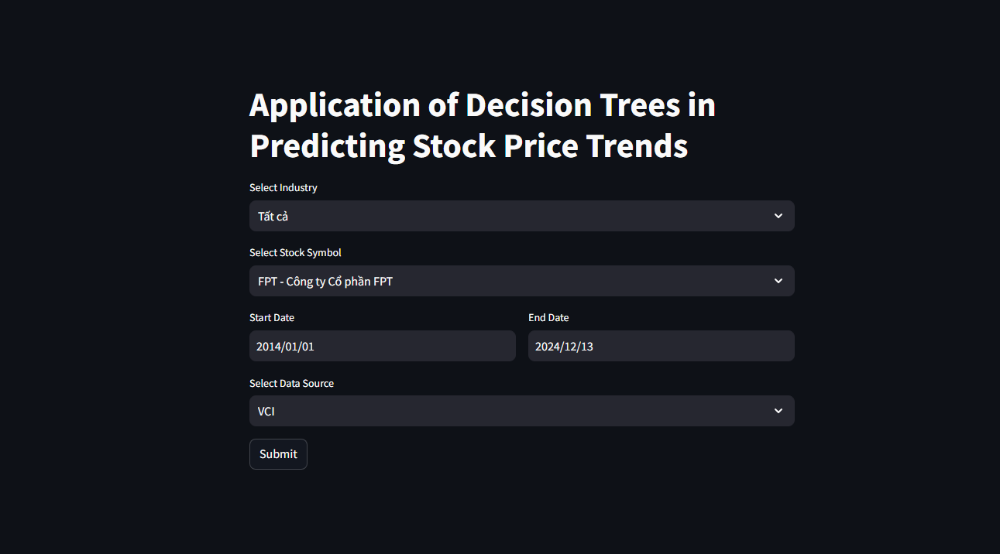
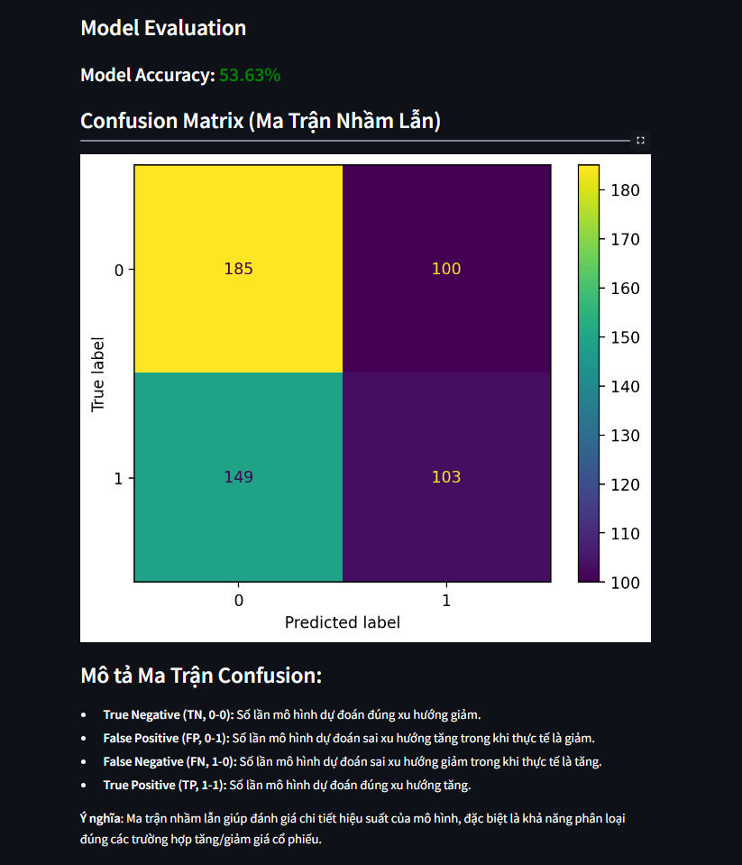
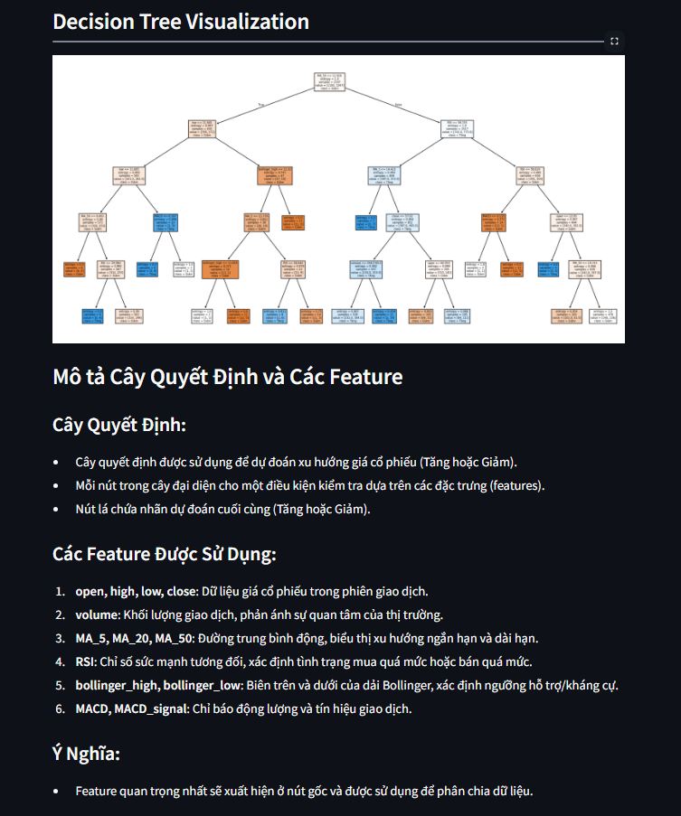
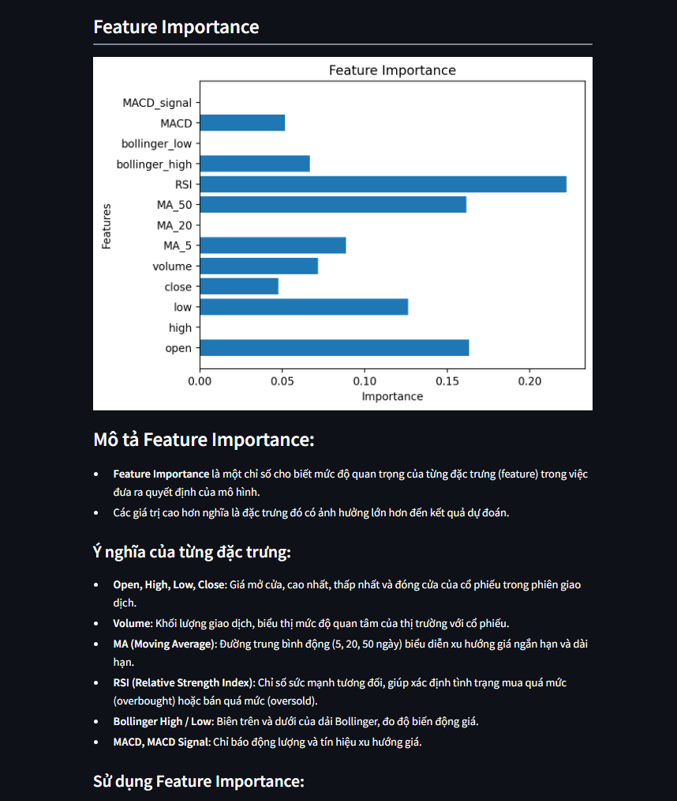

# Stock Analysis Project

## Overview
This project analyzes stock price trends using technical indicators and machine learning with a decision tree model. The application is built using **Streamlit** for an interactive user interface.

## Features
1. Select industry and stock symbol.
2. Specify the date range for analysis.
3. Choose data source (e.g., VCI, TCBS).
4. Visualize:
   - Confusion Matrix
   - Decision Tree
   - Feature Importance
5. Download processed data as an Excel file.

## Requirements
This project requires **Python 3.12** to ensure compatibility and proper testing.

## File Structure
```
|-- src/                  # Source code directory
    |-- app.py            # Main Streamlit application
    |-- vnstock.py        # VnStock class implementation
|-- data/                 # Directory for downloaded Excel files
|-- notebook/             # Jupyter notebooks for additional experiments
    |-- main.ipynb        # Main notebook for testing and debugging
|-- requirements.txt      # Dependencies
|-- .gitignore            # Git ignore file
|-- README.md             # Project documentation
```

## How to Run

1. Clone the repository:

```bash
git clone https://github.com/ellyx13/stock-trend.git
cd stock-trend
```

2. Install required dependencies:

```bash
pip install -r requirements.txt
```

3. Run the Streamlit application:

```bash
streamlit run src/app.py
```

4. Open the application in your browser. It will automatically launch at:

```
http://localhost:8501
```

## Usage

### Step 1: Select Industry and Stock Symbol
- Use the dropdown to select an industry.
- Choose a stock symbol from the filtered list.

### Step 2: Specify Date Range
- Use the date pickers to set the start and end dates for the analysis.

### Step 3: Choose Data Source
- Select the data source (e.g., VCI, TCBS).

### Step 4: Run Analysis
- Click the **Submit** button to:
  - Fetch stock data.
  - Calculate technical indicators.
  - Train a decision tree model.
  - Display analysis results.

### Step 5: View Results
- Visualizations:
  - **Confusion Matrix**: Understand model performance.
  - **Decision Tree**: See the logic behind predictions.
  - **Feature Importance**: Identify the most influential factors.
- Processed Data:
  - View processed stock data in a table.
  - Download the data as an Excel file.

## Screenshots

### Home Screen


### Analysis Results
- **Confusion Matrix**


- **Decision Tree**


- **Feature Importance**


## License
This project is licensed under the MIT License.

